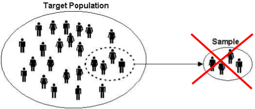

<style>
h2 { 
 color: #3399ff;		
}
h3 { 
 color: #3399ff;		
}
slides > slide.backdrop {
  background: white;
}
</style>

```{r setup, include=FALSE}
knitr::opts_chunk$set(echo = TRUE)
```

```{r, echo=FALSE, message=FALSE, warning=FALSE}
library(tidyverse)
library(knitr)
library(mosaic)

library(okcupiddata)
data(profiles)
profiles <- profiles %>% 
  filter(!is.na(height))
```


## Recap

Over the last couple of days, for a sample size `n=5` and `n=50`

* Took many, many, many samples of size `n`
* Computed the sample mean height $\overline{x}$
* Studied the variability/uncertainty of the 10,000 **simulated** $\overline{x}$, as quantified by the standard error.


## Recap

i.e. an expanded version of this

|Random Sample            | (Sample) Mean Age|
|:------------------------|-----------------:|
|Jack, Jared, Sam         |              21.7|
|Wengel, Rebecca, Steven  |              19.4|
|Stefan, Joccelyn, Sierra |              20.0|


## Question 1

However, we know the true population mean height $\mu$: the average of the 60K
OkCupid user heights.

Why? Because we have access to the entire population:

```{r}
mean(profiles$height)
```


## Question 1


> * **Question**: If we know the true population mean height $\mu = 68.30$, then why are we sampling?
> * **Answer**: Only as a theoretical/rhetorical exercise to show the random behavior of $\overline{x}$.
> * **In Practice**: If you know the true value, then you don't need sampling.
> * 


## Question 2

Now, let's suppose we didn't know the true value $\mu$, so we needed to estimate it
using 

* A sample of size $n$
* A point estimate. For example the sample mean $\overline{x}$
* A confidence interval


## Question 2

> * **Question**: Why did we take 10000 samples of size `n=5` or `n=50` and compute 10000 sample means $\overline{x}$?
> * **Answer**: Only as a theoretical/rhetorical exercise to show the random behavior of $\overline{x}$.
> * **In Practice**: You only take **one** sample of size as large as you afford.


## A Theoretical/Rhetorical Exercise

[Tough concept to teach](https://twitter.com/rudeboybert/status/439167809575464961)


