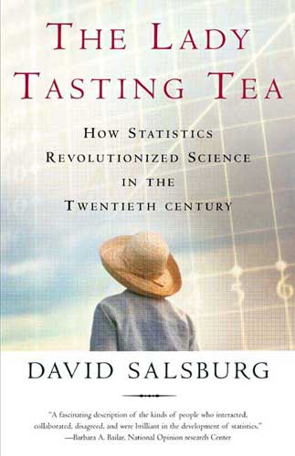

<style>
h2 { 
 color: #3399ff;		
}
h3 { 
 color: #3399ff;		
}
slides > slide.backdrop {
  background: white;
}
</style>

```{r setup, include=FALSE}
knitr::opts_chunk$set(echo = TRUE)
```

```{r, echo=FALSE, message=FALSE, warning=FALSE}
library(tidyverse)
library(knitr)
library(mosaic)
```


## Recall... Again

* **Lec20 Different Types of Sampling**:
    + You are a statistician and you meet someone who claims to be able to tell by tasting whether the tea or the milk was added first to a cup.
    + Say you have 8 cups, tea, and milk handy. 
* **Lec21 Randomized Experiments**:
    + How would you design an experiment to test whether a) they can really tell which came first or b) they are just guessing?

Today...

> * **Lec22**: You run the experiements and get results. What now?


## Lady Tasting Tea

This experiment is known as [The Lady Tasting Tea](https://en.wikipedia.org/wiki/Lady_tasting_tea), occurred in the early 1900's and the statistician was Ronald Fisher:



> * Reports indicate the taster got all 8 cups right.


## Lady Tasting Tea

Recall the two competing hypotheses:

1. She truly has the ability to tell which came first: milk or tea.
1. She is just guessing.

Let's suppose 2 is true...


## Lady Tasting Tea

... i.e. suppose she is guessing.

> 1. What is the probability she guesses one cup right?
> 1. What's more likely? That she get 4 correct or get 7 correct?
> 1. What is the probability she guesses **all eight** right?
> 1. **Big One:** How unlikely is this result? This is the ultimate statement: BS or not?


## Learning Check: Simulation

1. See if using the `resample()` and `do()` commands you can
    + simulate many, many, many cases of someone guessing at random for the eight cups, then
    + count the number of correct guesses
1. How would you compare
    + the **observed** number of correct guesses (in this case 8)
    + to the **typical** number of correct guesses assuming she is guessing at random?


## Learning Check: Starter Code

Create a new R Script (File -> New File -> R Script) and copy 
the following starter code:

```{r, eval=FALSE}
library(ggplot2)
library(dplyr)
library(mosaic)

# Single cup
guess_cup <- c(1, 0)

```


## Learning Check: For Problem Set08

* We define `guess_cup <- c(1, 0)` where
    + `1` denotes correctly guessed
    + `0` denotes incorrectly guessed
* So to count the number correct you only need to `sum()` values of `0` and `1`.


