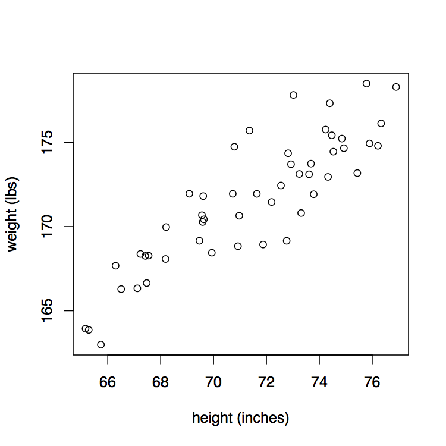
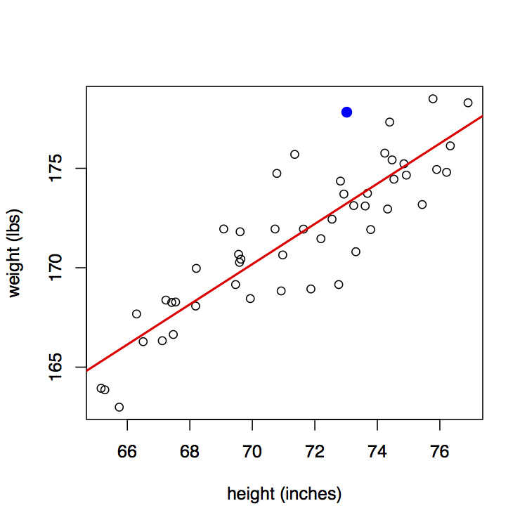
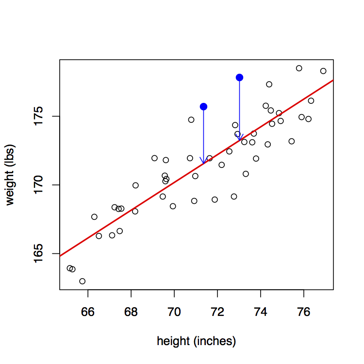
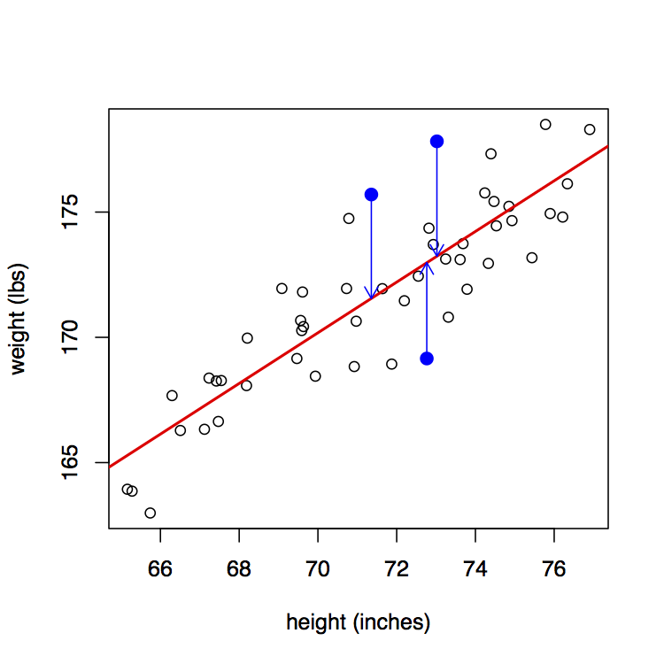
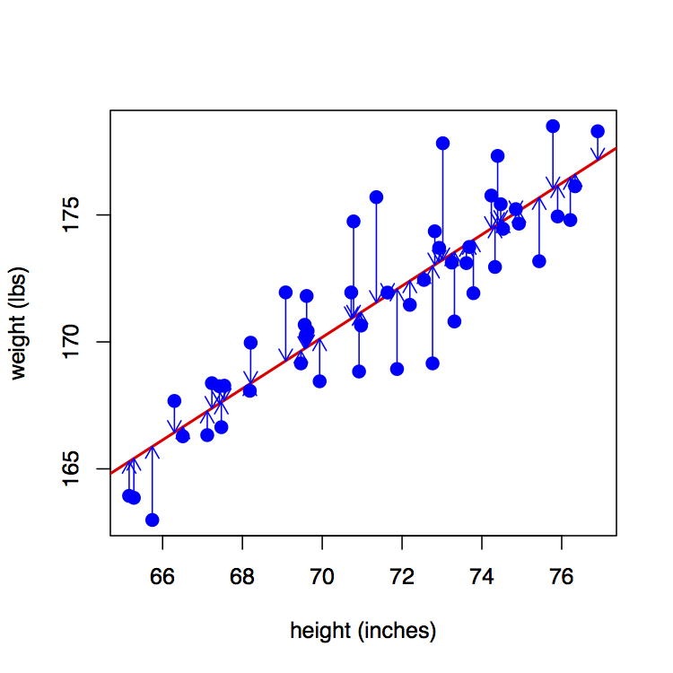

<style>
h2 { 
 color: #3399ff;		
}
h3 { 
 color: #3399ff;		
}
slides > slide.backdrop {
  background: white;
}
</style>

```{r setup, include=FALSE}
knitr::opts_chunk$set(echo = TRUE)
```

```{r, echo=FALSE, message=FALSE, warning=FALSE}
library(tidyverse)
library(nycflights13)
data(flights)
```


## Recall

* The (population) regression line: $y = \beta_0 + \beta_1 x + \epsilon$
* When $\beta_1=0 \Longrightarrow$ no relationship between variables x and y
* The p-value for $\beta_1$ is based on:
    + $H_0: \beta_1=0$ vs
    + $H_A: \beta_1\neq 0$ 
* If CI for $\beta_1$ does not contain 0, it suggests a significant relationship between x and y.


## Best Fitting Ling

What does "best fitting line"" mean?




## Best Fitting Ling

Consider ANY point (in blue). 




## Best Fitting Ling

Now consider this point's deviation from the regression line.


## Best Fitting Ling

Do this for another point...




## Best Fitting Ling

Do this for another point...




## Best Fitting Ling

Regression line minimizes the sum of **squared** arrow lengths.  




## Residuals

* Population regression line: 
$$y = \beta_0 + \beta_1 x + \epsilon$$
* Sample AKA fitted regression line based on points $(x_i, y_i)$ for $i=1, \ldots, n$:
$$
\widehat{y}_i = \widehat{\beta}_0 + \widehat{\beta}_1 x_i
$$


## Residuals


> * $y_i$ observed value: blue point
> * $\widehat{y}_i$ fitted value: value on red line
> * **Residual** $\epsilon_i = y_i - \widehat{y}_i$: length of arrow


## Residuals

* They're the error, the lack of fit, what's leftover.
* It's the **noise** around the signal (regression line).
* Punchline: We want there to be no systematic pattern in the residuals.


