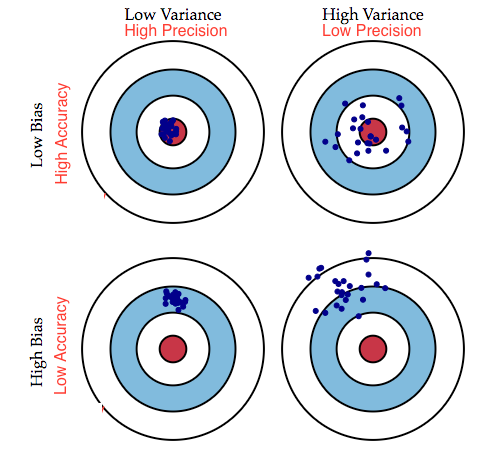
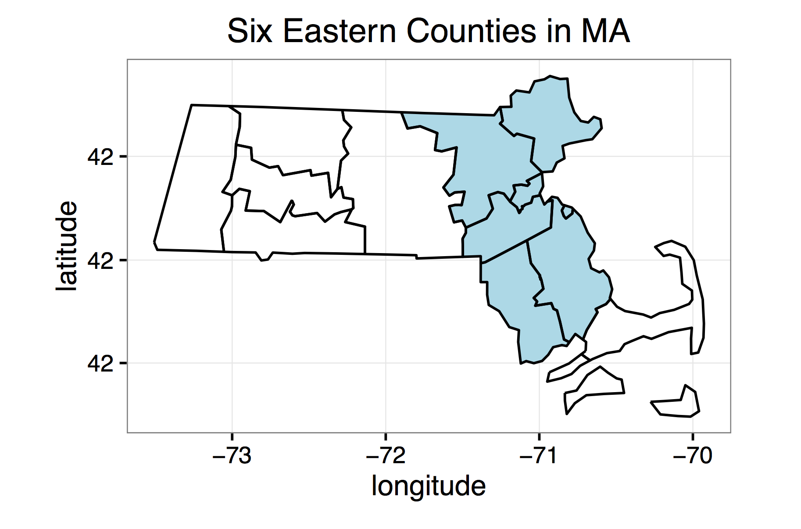

<style>
h1{font-weight: bold;}
h2{color: #3399ff;}
h3{color: #3399ff;}
slides slide.backdrop {background: white;}
</style>
<style type="text/css">
slides > slide:not(.nobackground):after {
  content: '';
}
</style>

```{r setup, include=FALSE}
knitr::opts_chunk$set(echo = FALSE, message = FALSE, warning = FALSE, fig.width=8, fig.height=4.5)
if(FALSE){
  # HEADS UP
  # Run these lines to render the document as running HTML document instead of
  # slides:
  rmarkdown::render("slides.Rmd", output_format = c("html_document"))
  knitr::purl("slides.Rmd")
}
```

```{r, echo=FALSE, message=FALSE}
library(tidyverse)
library(mosaic)
```


<!----------------------------------------------------------------------------->
# Lec35 - Wed 5/3: Confidence Intervals Part II

## Recall


## In General

If $n$ is large, the sampling distribution for these sample statistics are 
bell-shaped, thus a 95% C.I. is $\mbox{PE} \pm 1.96\times \mbox{SE}$.

Population Parameter | Sample Statistic
------------- | -------------
Mean $\mu$ | Sample Mean $\overline{x}$
Proportion $p$ | Sample Proportion $\widehat{p}$
Diff of Means $\mu_1 - \mu_2$ | $\overline{x}_1 - \overline{x}_2$
Diff of Proportions $p_1 - p_2$ | $\widehat{p}_1 - \widehat{p}_2$


## Example: Polls

<a target="_blank" class="page-link" href="http://n.pr/1f3TnW8">NPR report on Obama</a> from 2013. Chalk talk...

<!--
> * According to a Harvard University Institute of Politics poll, 41
percent of millennials approve of Obama's job performance
> * The online survey of 2089 adults was conducted from 10/30 to 11/11...
The poll's **margin of error** was plus or minus 2.1 percentage points.
> * Chalk talk...
-->


<!----------------------------------------------------------------------------->
# Lec34 - Mon 5/1: Confidence Intervals

## Recall

We are estimating a *population parameter* using a *point estimate* based on a
sample. Example: Mean (Chalk Talk)

<!--
Think of

> * Population mean $\mu$: the target
> * Sample mean $\overline{x}$: the shot at target
> * Sampling distribution: the distribution of the shots
> * Standard error: the varibility/consistency of the shots
-->


## Accuracy vs Precision

<center></center>


## Confidence Intervals

Imagine the $\mu$ is a fish:

Point Estimate $\overline{x}$            |  Confidence Interval
:-------------------------:|:-------------------------:
  |  


## Learning Check Discussion

> * <a target="_blank" class="page-link" href="https://rudeboybert.github.io/MATH116/LC.html#lec33_-_fri_428:_sampling_distributions_and_standard_errors">Lec33 Learning Check Discussion</a>
> * Chalk Talk.


<!----------------------------------------------------------------------------->
# Lec33 - Fri 4/28: Sampling Distributions and Standard Errors

## Recall

Age example:

> 1. I picked a random sample of `n=3` students
> 1. I computed sample mean age $\overline{x}$
> 1. I did this three times

Note:

> 1. They are not the same because of sampling variability
> 1. What quantifies how much these point estimates vary? 


## Lec32 Learning Check

From the OkCupid population:

> 1. Take samples of size `n`
> 1. Compute sample mean height $\overline{x}$
> 1. Do this many, many, many times (10000)
> 1. Visualize distribution of these sample means


## Lec32 Learning Check

```{r, eval=TRUE, echo=FALSE}
library(okcupiddata)
data(profiles)
```

```{r, eval=TRUE, echo=FALSE, cache=TRUE}
samples_5 <- do(1000) * mean(resample(profiles$height, size=5, replace=TRUE))
samples_10 <- do(1000) * mean(resample(profiles$height, size=10, replace=TRUE))
samples_100 <- do(1000) * mean(resample(profiles$height, size=100, replace=TRUE))

results <- data_frame(
  n = c(rep(5, 1000), rep(10, 1000), rep(100, 1000))
)
results <- results %>% 
  bind_cols(
    bind_rows(samples_5, samples_10, samples_100)
  )

# Part 4:
ggplot(results, aes(x=mean)) +
  geom_histogram(binwidth = 0.75) +
  labs(x="sample mean height") + 
  facet_wrap(~n) + 
  xlim(c(50,80)) +
  geom_vline(xintercept=mean(profiles$height, na.rm=TRUE), col="red")
```


## Accuracy vs Precision

<center></center>


<!----------------------------------------------------------------------------->
# Lec32 - Thu 4/27: Back to Sampling

## Recall: Point of Statistics

Taking a **sample** in order to **infer** about a **population**:

<center></center>

</br>

Let's Google "define infer"...


## Demo for Today

```{r, eval=FALSE, echo=TRUE}
library(lubridate)
library(mosaic)
library(dplyr)

# Randomly sample three people:
students <- 
  c("Arthur", "Caroline", "Claire", "Clare", "Conor", "Daniel", 
    "Dylan", "Elana", "Jacob", "Jay", "Joe", "Julian", "Kelsie", 
    "Lisa", "Maya", "Naing", "Parker", "Rebecca", "Ry", "Theodora", 
    "Zebediah", "Albert")
resample(students, size=3, replace=FALSE)

# Get average age:
birthdays <- c("1980-11-05", "2000-01-01", "1955-08-05")
ages <- as.numeric(as.Date("2017-04-27") - as.Date(birthdays))/365.25
ages
mean(ages)
```


## Demo for Today

> * We randomly sample 3 students and get mean age
> * We randomly sample 3 students and get mean age
> * We randomly sample 3 students and get mean age...

**Questions**: 

> 1. Why is the mean (AKA) age different each time?
> 1. What numerical summary quantifies how these means vary?

Chalk talk...

<!---
**Sample statistics** estimate unknown population parameters. From last lecture:

Population Parameter | Sample Statistic
------------- | -------------
Mean $\mu$ | Sample Mean $\overline{x}$
Proportion $p$ | Sample Proportion $\widehat{p}$
Diff of Means $\mu_1 - \mu_2$ | $\overline{x}_1 - \overline{x}_2$
Diff of Proportions $p_1 - p_2$ | $\widehat{p}_1 - \widehat{p}_2$
-->


<!----------------------------------------------------------------------------->
# Lec31 - Wed 4/26: Background Statistical Theory

## There is Only One Test


<!--Image source [here](http://allendowney.blogspot.com/2016/06/there-is-still-only-one-test.html)-->


## Today: Chalk talk

> * Hypothesis testing in general
> * Background statistical theory


<!--
## Hypothesis Testing in General

> 1. Construct $H_0$ and $H_A$ in terms of population parameters
> 1. Identify the test statistic
> 1. Compute the observed test statistic based on data
> 1. Construct the null distribution of the test statistic assuming $H_0$
> 1. Compare the observed test statistic to the null distribution to compute the **p-value**
-->


<!----------------------------------------------------------------------------->
# Lec30 - Mon 4/24: Finishing Hypothesis Testing

## Today

> * View Lec29 Learning Check
> * Chalk talk


<!----------------------------------------------------------------------------->
# Lec29 - Thu 4/20: Permutation Test

## Recall

If we assume $H_0$ is true (there is no difference in test scores between evens
and odds) then:

1. Whether you have an even number of letters or odd is *irrelevant*
1. Hence the categorical variable `even_vs_odd` is *irrelevant*
1. Hence we can permute/shuffle it to *no consequence*

```{r, echo=FALSE}
grades <- read_csv(file="assets/data/grades.csv") %>% 
  slice(4:8) %>% 
  select(-major) %>% 
  mutate(final = round(final, 2))
```


## In Other Words, All These Are the Same:

```{r, echo=FALSE}
grades %>% 
  mutate(even_vs_odd=shuffle(even_vs_odd))
```

## In Other Words, All These Are the Same:

```{r, echo=FALSE}
grades %>% 
  mutate(even_vs_odd=shuffle(even_vs_odd))
```

## In Other Words, All These Are the Same:

```{r, echo=FALSE}
grades %>% 
  mutate(even_vs_odd=shuffle(even_vs_odd))
```

## In Other Words, All These Are the Same:

```{r, echo=FALSE}
grades %>% 
  mutate(even_vs_odd=shuffle(even_vs_odd))
```


<!----------------------------------------------------------------------------->
# Lec28 - Wed 4/19: Constructing the Null Hypothesis

## Recall

From last lecture: *How do we construct null distribution?*


## Lady Tasting Tea

In this case, the null distribution is barplot:

```{r}
set.seed(76)
```

```{r, cache=TRUE}
single_cup_outcome <- c(1, 0)
simulation <- do(10000) * resample(single_cup_outcome, size=8)
simulation <- simulation %>% 
  mutate(n_correct = V1 + V2 + V3 + V4 + V5 + V6 + V7 + V8) 
ggplot(simulation, aes(x=n_correct)) + 
  geom_bar() +
  labs(x="Number of Guesses Correct")
```


## Two Ways

Analytically           |  Via Simulation
:-------------------------:|:-------------------------:
  |  


## Two Ways

> * **Analytically/Mathematically**: Necessitates probability background. Covered in MATH 310.
> * **Simulation**: Necessitates random number generator. We take this approach.


## Constructing the Null

* Lady Tasting Tea: Assuming she is guessing at random, we **simulated** many, many, many instances of "the number she got right".
* Odds vs Evens Test Score: Chalk talk


<!----------------------------------------------------------------------------->
# Lec27 - Mon 4/17: Tying Hypothesis Testing with Sampling

## Chalk Talk

Only chalk talk today, based on Learning Checks for Lec26.


<!----------------------------------------------------------------------------->
# Lec26 - Fri 4/14: p-Values

## Recall: Framework and Terminology

1. **Null hypothesis $H_0$**: she is guessing at random
2. **Alternative hypothesis $H_A$**: she is not. i.e. she can really tell which came first
3. **Test statistic**: # of correct guesses out of 8
4. **Observed test statistic**: 8 correct
5. **Null distribution**: the bar chart
6. **Decision**: compare observed test statistic to null distribution


## Recall: Framework and Terminology

* We going to **assume** $H_0$ is true and see how likely the observed test statistic was as compared to null distribution.
* How likely was the observed test statistic?


```{r}
set.seed(76)
```
```{r, cache=TRUE}
single_cup_outcome <- c(1, 0)
simulation <- do(10000) * resample(single_cup_outcome, size=8)
simulation <- simulation %>% 
  mutate(n_correct = V1 + V2 + V3 + V4 + V5 + V6 + V7 + V8) %>% 
  group_by(n_correct)
```


## Recall: Framework and Terminology

**Not very!** Only occurs `r round(100*sum(simulation$n_correct == 8)/nrow(simulation), 3)`% of the time

```{r, cache=TRUE}
ggplot(simulation, aes(x=n_correct, y=n_correct)) + 
  geom_bar(stat="identity") +
  labs(x="Number of Guesses Correct", y="Count") +
  geom_vline(xintercept=8, col="red") 
```


## Today's Definition

**p-value**: Chalk Talk

<!--

Definitions:

> * Statistically: the probability of observing a test statistic as extreme as the
one observed **assuming $H_0$ is true**.
> * Conceptually: measures our degree of surprise (lower = more surprised) of what we observed **assuming $H_0$ is true**.

Example:

It answers: how unlikely is it that the taster got 8 out of 8 right **assuming she was just guessing at random**

p-Value meaning:

> * Conceptually: **Assuming she was guessing at random**, we are **very surprised** at observing 8 correct guesses
> * Statistically: probability of observing a test statistic of 8 **assuming $H_0$ is true** is approx. 0.5%.  i.e. TINY

Study Conclusion:

> * Conceptually: She was probably NOT guessing at random; she probably could tell.
> * Statistically: We reject $H_0$ in favor of $H_A$

-->


<!----------------------------------------------------------------------------->
# Lec25 - Thu 4/13: Hypothesis Testing Framework and Terminology

## Recall: Lady Tasting Tea

* Lady Tasting Tea claims she can tell if tea or milk was poured first into a cup
* You run an experiment with 8 cups if she can tell or if she is bullshitting
* Let's **assume a hypothetical world where she is guessing at random**.


## Recall: Lady Tasting Tea

If guessing at random, here are **hypothetical** outcomes:


```{r}
set.seed(76)
```
```{r, cache=TRUE}
single_cup_outcome <- c(1, 0)
simulation <- do(10000) * resample(single_cup_outcome, size=8)
simulation <- simulation %>% 
  mutate(n_correct = V1 + V2 + V3 + V4 + V5 + V6 + V7 + V8) 
ggplot(simulation, aes(x=n_correct)) + 
  geom_bar() +
  labs(x="Number of Guesses Correct")
```

## Recall: Lady Tasting Tea

She got 8/8 right!

```{r, cache=TRUE}
ggplot(simulation, aes(x=n_correct)) + 
  geom_bar() +
  labs(x="Number of Guesses Correct") +
  geom_vline(xintercept = 8, col="red")
```


## Recall: Lady Tasting Tea

* In our hypothetical world of guessing at random, 8/8 occured 
`r sum(simulation$n_correct == 8)` times out of `r nrow(simulation)`. i.e. 
`r round(100*sum(simulation$n_correct == 8)/nrow(simulation), 3)`% of the time. 
* Can she tell, or is she bullshitting?


## Hypothesis Testing Framework

Critical chalk talk.


<!----------------------------------------------------------------------------->
# Lec23 - Mon 4/10: Midterm II Review

## Administrative

* Evening Exam: Wed 4/7 7pm in Warner 506
* Closed book, no calculators
* Bring your cheatsheets


## Philosophy

* More conceptual in nature
* Code:
    + Reading/understanding: Fair game
    + Writing: No direct code to write, but **pseudocode**
* Normal curve of distribution of difficulty


## Sources

* Lectures 01 through 21 inclusive and cummulative
    + Slides from each lecture
    + Corresponding textbook material (if any)
    + Learning Checks
    + Problem Sets


## Major Topics: Midterm I

* Tidy data. What are the components?
* What is the Grammar of Graphics? How do they tie in with `ggplot2`?
* What are the first four of the 5NG? What are their distinguishing features?


## Major Topics: Midterm II

* All five of the 5NG
* Data manipulation/wrangling
    + 5MV + `join`
    + Putting it all together: <a target="_blank" class="page-link" href="https://rudeboybert.github.io/MATH116/notes.html#lec18_-_fri_324:_the_tao_of_data_analysis">Lec18 - Fri 3/24: The tao of data analysis</a>.
* Sampling, probability, confounding variables, and designed experiments.


## Practice Midterm

* Disclaimer, disclaimer, disclaimer
    + Do not overly interpret the content of this midterm.
    + Rather, view it to get a rough sense of my exam philosophy.
* Note: There was no probability in last year's Midterm II


<!----------------------------------------------------------------------------->
# Lec22 - Fri 4/7: Lady Tasting Tea

## Scenario for Today

* Say you are a statistician and you meet someone called the "Lady Tasting Tea."
* She claims she can tell by tasting whether the tea or the milk was added first to a cup.
* You want to test whether
    + She can actually tell which came first **OR**
    + She's lying and is only guessing at random
* Say you have just enough tea/milk to pour into 8 cups.


## Coding Note

Binary situations, like

> * True vs False
> * Correct vs Incorrect
> * Yes vs No

are often coded as `1` vs `0` in many programming languages.


<!----------------------------------------------------------------------------->
# Lec21 - Thu 4/6: Confounding Variables and Designed Experiments

<!-- IGNORE THIS
## Explanatory and Response Variables

A medical doctor pours over some his patients' medical records and observes:

People who do this:            |  Wake up with this:
:-------------------------:|:-------------------------:
  |  


## Explanatory and Response Variables

He then asserts the following **causal** relationship:

* **Explanatory AKA treatment variable**: sleeping with shoes on 
* **Response variable**: causes one to wake up with a headache

What's wrong?

-->


## Today: Other Use of Randomness

1. **Random sampling**: To obtain a representative sample from a population.
1. **Random assignment**: To design an experiement.


## Mantra of Statistics

> * **Correlation is not necessarily causation**
> * [Spurious correlations](http://tylervigen.com/spurious-correlations)


## Chalk Talk


> * Confounding variables
> * Two types of studies
> * Principles of designing experiments


<!--

## Confounding Variable

Diagram


## Two Types of Studies

To study the effect of a treatment there are two types of studies

* **Observational studies**: Researchers have no control over who receives the treatment
* **Randomized experiments**: Researchers not only have control over who receives the treatment, but also make random assignments


## Two Types of Studies

> * Making causal statements with observational studies is harder because you
need to **control for** (account for) all possible confounding variables; in this case
alcohol. But you may not have access to all confounding variables.


## Back to Example

* The treatment, sleeping with shoes on, was NOT assigned at random; we have an 
**observational study**.
* We can't assert **causation**, but only **association/correlation**
> * Say for each patient you have two variables: 1) whether they slept with shoes on and 2) whether they woke up with a headache
> * To assert causality, we would need a **randomized experiment**!


## Principles of Designing Experiements

* Controlling:  We want to control i.e. account for differences between the two groups.
* Control group: A baseline group to compare the treatment group to
* Randomization: We randomize individuals into treatment vs control so that any differences in variables that are not of interest even out in the long run.  
* Replication:  The more cases we observe, the more "precise" the results.
* Blocking:  Researchers sometimes know or suspect that variables, other than the treatment, influence the response. In this case, they may first group individuals based on this variable into blocks and then randomize cases within each block.  
* Blindedness: When researchers do not inform patients which group they are in
* Double blinded study:  When the person administering the treatment themselves do not know which group the patient is in.
* Placebo: Fake treatment.  Sometimes the thought alone of having a treatment is enough to influence behavior/results.  

-->


<!--
## Learning Check

I went to grad school in Seattle, where Garfield High School is located. Famous
alums include:

* Quincy Jones: Producer and composer
* Jimi Hendrix: Guitarist
* Brandon Roy: Former NBA Rookie of the Year
* Macklemore: Rapper
* Minoru Yamasaki: World Trade Center architect
-->


## Learning Check

Ezell's Fried Chicken is a famous chicken restaurant in Seattle. Oprah Winfrey
has it flown into to Chicago.

<center></center>


## Learning Check

One day I was raving about Ezell's Chicken, but my friend accused me of "buying into the hype".

So what did we do?


## Learning Check

Fried Chicken Face Off:

Do people prefer this?            |  Or this?
:-------------------------:|:-------------------------:
  |  


## Learning Check

How would you design a taste test to ascertain, independent of hype, which fried chicken tastes better?

Use the relevant principles of designing experiements from above.


<!----------------------------------------------------------------------------->
# Lec20 - Wed 4/5: Introduction to Sampling

## Recall

The `mosaic` package has functions for the random simulation.

1. `rflip()`: Flip a coin
1. `shuffle()`: Shuffle a set of values
1. `do()`: Do the same thing many, many, many times
1. `resample()`: the **swiss army knife** for sampling


## Shuffling AKA Permuting

Run the following in your console:

```{r, eval=FALSE, echo=TRUE}
library(mosaic)
# Define a vector fruit
fruit <- c("apple", "orange", "mango")

# Do this multiple times:
shuffle(fruit)
```


## Sampling: Key Distinction

Two types of sampling:

1. Sampling **with** replacement
1. Sampling **without** replacement


## Resampling

`resample()` by default samples **with** replacement. Run this in the console multiple times:

```{r, eval=FALSE, echo=TRUE}
resample(fruit)
```


## Possible Inputs to `resample()`

Chalk Talk

<!--
```{r, eval=FALSE, echo=FALSE}
resample(x=fruit, size=length(fruit), replace=TRUE, 
         prob=rep(1/length(fruit), length(fruit)) )
```

> * `x` is the input. In this case `fruit`.
> * `size`: size of output vector. By default the same size as `x`.
> * `replace`: Sample **with** or **without** replacement. By default with replacement.
> * `prob`: Probability of sampling each input value. By default, equal probability
> * Run `rep(1/length(fruit), length(fruit))` in your console. In the case of
`fruit`, this vector is `rep(1/3, 3)` i.e. repeat 1/3 three times.
-->


<!----------------------------------------------------------------------------->
# Lec19 - Mon 4/3: Intro to Probability via Simulation

## Recall

Chalk Talk 1

<!--
Recall:

> * **Random** sampling: where we select the sample from the population in an unbiased fashion
> * Bias: A sample is biased if some observational units have a higher **probability** of being
included in the sample. 
> * Keywords: **random** and **probability**
-->


## Probability

> * In short: Probability is the study of **randomness**.
> * Its roots lie in one <a target="_blank" class="page-link" href="https://www.google.com/search?q=probability&newwindow=1&source=lnms&tbm=isch&sa=X&ved=0ahUKEwjnvJG7_oTQAhVIQiYKHSQ7CnoQ_AUICSgC&biw=2559&bih=1316&dpr=2#newwindow=1&tbm=isch&q=history+of+gambling">historical constant</a>
> * It is the theoretical backbone of statistics.


## Two Approaches to Probability

There are two approaches to studying probability:

Mathematically (MATH 310)           |  Via Simulations
:-------------------------:|:-------------------------:
  |  


## Two Approaches to Probability

* The mathematical approach requires A LOT of math background, whereas the simulation approach does not.
* To do simulations, we need a computer's **random number generator**. Why?


## Simulations via Computer

Doing this repeatedly by hand is tiring:

  
  
  
  
  


<!-- DEPRECATED

## Analogy for Random Simulation

> * Analogy for rest of course: POWERBALL
> * 
> * We can model **any** random simulation by tinkering with the following **attributes** of Powerball:


## Attributes of Powerball

* Atrributes of the Lottery Machine:
    * How many balls do you have?
    * What are written on the balls?
    * Do the balls have equal probability of being picked?
* Attributes of the Drawing:
    * How are you drawing the balls?
    * How many balls do you draw?
    * What are you recording about each drawn ball?
    * What do you do with drawn balls?
* Number of Lotteries:
    * How many times do you repeat the lottery?
-->


## Tools

All hail the `mosaic` package: `library(mosaic)`. 

Chalk Talk 2

<!--
The following 4 functions will give us (most of) the random simulation tools we need:

> 1. `rflip()`: Flip a coin
> 1. `shuffle()`: Shuffle a set of values (akin to cards)
> 1. `do()`: Do the same thing many, many, many times
> 1. `resample()`: the swiss army knife of functions
--> 


<!----------------------------------------------------------------------------->
# Lec18 - Fri 3/24: The Tao of Data Analysis

## Tips for Problem Set 07

Best viewed in HTML mode, not slide deck mode:

1. Define your target
1. Clean up your workspace
1. Have a plan


## 1. Define your target

You should **draw out** what your end data frame should look like **in tidy format**:

* How many columns and what are their names i.e. the variables
* How many rows will I have?
* Fill in elements of the table the best you can.

**Why?** If you don't clearly identify this, not only will your work not be focused, but more 
importantly, how would you know when you're done? 


<!--
In our case since we are 
comparing capacity (as measured by available seat miles) at the three airports 
for Virgin America and ExpressJet, we know before even typing a single line of 
code, our end table should look something like this:

|Airport |Airlines | Available Seat Miles|
|:------|:-------|----------------:|
|JFK    |VX      |       some value|
|JFK    |EV      |       some value|
|EWR    |VX      |       some value|
|EWR    |EV      |       some value|
|LGA    |VX      |       some value|
|LGA    |EV      |       some value|


**Advanced**: A previous student pointed out that a table like this would work too:

|Airport |VX Available Seat Miles | EV Available Seat Miles|
|:------|:-------|----------------:|
|JFK    |some value|       some value|
|EWR    |some value|       some value|
|EWR    |some value|       some value|

But note this is not in tidy data format (i.e. long format), but in wide format.
For `ggplot2` and `dplyr` to work, we need to be consistent about the data 
format: only tidy format. If you do want to switch from tidy/long to wide
format or vice versa, you can use the `tidyr` package: see the `dplyr`
cheatsheet, front page, "Reshaping Data" section, `gather()` and `spread()`
functions. This is for a more advanced class however.
-->


## 2. Clean up your workspace

Before starting any substantive data wrangling using `mutate`, `summarise`, `arrange`, or `_join`, I like
to pare down the necessary data sets to the minimum of what I need by

* `filter` only the absolutely necessary rows
* Optional: `select` only the absolutely neccesary columns

**Why?** This has several benefits:

1. It will make it much easier to digest `View()`s of your work as you progress.
1. It will minimize the chance of weird errors creeping in.
1. **Most importantly**: It will force you to think
    + "What variables do I need?" and hence
    + "Where are they located?" and hence
    + "What data sets do I need?"

<!--
In our case, we are going to need the following variables:

* `carrier` and `origin` for the end table, both in the `flights` data set
* `distance` and `seats` to compute `total_seat_miles`, with `seats` being in the `planes` data set
* `tailnum` to be able to join/merge `flights`  and `planes`
-->


## 3. Have a plan

1. Explicitly draw out on paper/blackboard what the end data frame should look like.
1. Based on the variables in this table, reverse-engineer what variables you will need
from the five `nycflights13` data sets: `flights`, `planes`, `airlines`, `weather`, and `airports`.
1. Explicitly write out **pseudocode** on paper/blackboard all data wrangling steps you need to get to your goal. i.e. **What** am I doing?
1. Only after you've done 1-3, then start coding. i.e. **How** am I going to do it?

**Why?** If you confuse the **what** and the **how**, you'll only get doubly lost. Separate them out!


<!----------------------------------------------------------------------------->
# Lec17 - Wed 3/22: Intro to Statistical Inference

## Switching Gears

Done with "Tidy" and "Transform", start with "Model":


## Example

Growing up I used to only eat white rice, but now I only eat multigrain rice.

White Rice           |  Multigrain Rice
:-------------------------:|:-------------------------:
  |  


## Example

What is my spin on multigrain rice made of?

> 1. Brown rice
> 1. Sweet brown rice
> 1. Barley
> 1. Red beans
> 1. Black beans


## Questions

* Of all the kernels in this tub **what percent are red beans**?
* **Question about question**: How can I answer this question with the minimal amount of effort?
* Most often heard of example leading up to November 2016.


## The Paradigm for the Rest of the Class

<center></center>

Chalk Talk


## Learning Check

For each of the following 4 scenarios 

1: Identify

> * The **population** of interest and if applicable the **population parameter**
> * The **sample** used and if applicable the **statistic**

2: Comment on the **representativeness/generalizability** of the results of the sample to the population.


## Learning Check

> 1. The Royal Air Force wants to study how resistant their airplanes are to bullets. They study the bullet holes on all the airplanes on the tarmac after an air battle against the Luftwaffe (German Air Force).
> 1. You want to know the average income of Middlebury graduates in the last 10 years.  So you get the records of 10 randomly chosen Midd Kids.  They all answer and you take the average.
> 1. Imagine it's 1993 i.e. almost all households have landlines.  You want to know the average number of people in each household in Middlebury.  You randomly pick out 500 phone numbers from the phone book and conduct a phone survey.
> 1. You want to know the prevalence of illegal downloading of TV shows among Middlebury students.  You get the emails of 100 randomly chosen Midd Kids and ask them "How many times did you download a pirated TV show last week?"


<!----------------------------------------------------------------------------->
# Lec16 - Mon 3/20: Importing Data

## Recall from the First Lecture

<!--
Hi professor, I really liked your intro stats class. Can I ask you a stats question on a bio project I'm working on?
I have gene expression data in this excel file. How would I run some of the methods we learned in class on it?
http://www.ios7text.com/em78xa
-->

> 


## Data/Science Pipeline


## How do I import my own data into R?

> * Not difficult, but it still takes practice.
> * You might need to do this for your final projects.


<!--
## Working Directory

Often before we can import our own data into R, we need to set the **working
directory** i.e. the folder R is going to look for files in.

Say there is a spreadsheet file you want to load into R:

1. In the Files Panel of RStudio, navigate to the folder where the spreadsheet file is.
1. In the Files Panel click -> More -> Set As Working Directory


## How do I import my own data into R?

Say your data is in an Excel file called `example.xlsx`

1. Make sure your values are in **tidy data format**
1. Set the correct working directory
1. Then use the `read_excel()` function in the `readxl` package as follows:

```{r, eval=FALSE, echo=TRUE}
library(readxl)
example <- read_excel("example.xlsx")
```
-->


## How do I import my own data into R?

> * Excel `.xlsx` files are clunky as they have lots of Microsoft metadata we
don't need. Can use `readxl` package to load Excel files
> * Comma-separated values `.csv` files are a **minimalist** spreadsheet format.


## What is a CSV file?

A `.csv` file [(example)](http://www.sqlshack.com/wp-content/uploads/2015/02/word-image35.png) is just data and no fluff:

> * Rows are separated by line breaks.
> * Values for a given row (i.e. variables) are separated by commas. Each row has equal number of commas.
> * The first row is typically a header row with the column/variable names


## Today's Exercise 1: Load a CSV into R

Today you will load `DD_vs_SB.csv` file that contains the Dunkin Donuts and
Starbucks data.  Delaney Moran scraped the web for the following data: For each of 1024 census tracts in Eastern Massachusetts:

* the number of Dunkin Donuts and Starbucks 
* median income

<center></center>


## Today's Exercise 1: Load CSV into RStudio

> 1. In the RStudio File Panel -> Navigate to the file -> Click on it and select -> "Import Dataset..."
> 1. Make sure "Heading" is set to "Yes". This tells RStudio that the first row are the variable names.
> 1. Click Import
> 1. The `View()` panel should pop up with the data. Make sure that the variable names are correct.
> 1. Plot this data!


<!--
## Today's Exercise: Load CSV into RStudio

Now look at your console. You should see a line that looks something like:

```{r, eval=FALSE, echo=TRUE}
DD_vs_SB <- read_csv("~/Problem_Sets/DD_vs_SB.csv")
```

This is the line of code that loads the CSV file into R and assigns it to an object
called `DD_vs_SB`, which you will be working with. 

1. Copy your version of the above line of code into the code block for Question 2 of `PS-07.Rmd`
1. Knit the file to test that it works
1. If so, start `PS-07.Rmd`!
-->


## Today's Exercise 2: Get Started with R Markdown

> * Start Problem Set 06 in R Markdown format
> * Biggest source of confusion: R Markdown has it's own **environment**. Just because something exists in your console, doesn't mean it exists in R Markdown.
> * <a target="_blank" class="page-link"
    href="https://docs.google.com/document/d/1P7IyZ4On9OlrCOhygFxjC7XhQqyw8OludwChz-uFd_o/">R Markdown Debugging</a> first


## Starbucks vs Dunkin Donuts

```{r, echo=FALSE}
DD_vs_SB <- readr::read_csv("assets/data/DD_vs_SB.csv")
```

We add regression lines...

```{r, echo=FALSE, eval=TRUE}
library(ggplot2)
ggplot(DD_vs_SB, aes(x=median_income, y=shops_per_1000)) +
  geom_point(aes(col=Type)) + 
  facet_wrap(~Type) +
  geom_smooth(method="lm", se=FALSE) + 
  labs(x="Median Household Income", y="# of shops per 1000 people", 
       title="Coffee/Cafe Comparison in Eastern MA") +
  scale_color_manual(values=c("orange", "forestgreen"))
```


## Code

After loading `DD_vs_SB.csv`:

```{r, echo=TRUE, eval=FALSE}
library(ggplot2)
ggplot(DD_vs_SB, aes(x=median_income, y=shops_per_1000)) +
  geom_point(aes(col=Type)) + 
  facet_wrap(~Type) +
  geom_smooth(method="lm", se=FALSE) + 
  labs(x="Median Household Income", y="# of shops per 1000 people", 
       title="Coffee/Cafe Comparison in Eastern MA") +
  scale_color_manual(values=c("orange", "forestgreen"))
```


<!----------------------------------------------------------------------------->
# Lec15 - Fri 3/17: 5MV#5 `arrange()` & `_join`

## Today: Five Main Verbs

> 1. ~~`filter()` rows/observations matching criteria~~
> 1. ~~`summarize()` numerical variables~~
> 1. ~~`group_by()` group rows/observations by a categorical variable~~
> 1. ~~`mutate()` existing variables to create new ones~~
> 1. **`arrange()` rows**

And `_join`!


## Arrange

Really simple. Either

* `DATASET_NAME %>% arrange(VARIABLE_NAME)` or
* `DATASET_NAME %>% arrange(desc(VARIABLE_NAME))`


## Arrange Example

```{r, eval=FALSE, echo=TRUE}
library(dplyr)

# Create data frame with two variables
test_data <- data_frame(
  name=c("Abbi", "Abbi", "Ilana", "Ilana", "Ilana"),
  value_1=c(0, 1, 0, 1, 0),
  value_2=c(4, 6, 3, 2, 5)
)

# See contents in console
test_data
```


## Arrange Example

Run this code. Notice the subtle diff between 2 and 3:

```{r, eval=FALSE, echo=TRUE}
# 1: Arrange in ascending order
test_data %>% 
  arrange(value_1)

# 2: Arrange in descending order
test_data %>% 
  arrange(desc(value_1))

# 3: Arrange in decending order of value_1, and then within
# value_1, arrange in ascending order of value_2
test_data %>% 
  arrange(desc(value_1), value_2)
```


## Combining Data Sets via Joins

And now the last component of data wrangling: **joining/merging two data sets**. Run the following:

```{r, eval=FALSE, echo=TRUE}
x <- data_frame(x1=c("A","B","C"), x2=c(1,2,3))
y <- data_frame(x1=c("A","B","D"), x3=c(TRUE,FALSE,TRUE))
x
y
```


## Combining Data Sets via Joins

We join by the `"x1"` variable. Note how it is in quotation marks.

```{r, eval=FALSE, echo=TRUE}
left_join(x, y, by = "x1")
full_join(x, y, by = "x1")
```


<!--
## Different Join Variable Name?

What the variable we want to join by has a different name in each data set? 
Here `a` vs `b`:

```{r, eval=FALSE, echo=TRUE}
i <- data_frame(a=c("A","B","C"), x2=c(1,2,3))
j <- data_frame(b=c("A","B","D"), x3=c(TRUE,FALSE,TRUE))
i
j
```


## Different Join Variable Name?

We use the `c()` function.

```{r, eval=FALSE, echo=TRUE}
left_join(i, j, by = c("a" = "b"))
```

It is a bit confusing unfortunately. It's

* `by = c("a"="b")` and not
* `by = c("a"=="b")`


## Different Join Variable Name?

There was an example of such a join in [Chapter 4.7.1](https://rudeboybert.github.io/IntroStatDataSciences/4-viz.html#barplots) on Barplots
where we `join` 

* `flights` data, which had airport codes in `origin`
* `airports` data, which had airport codes in `faa`

```{r, eval=FALSE, echo=TRUE}
inner_join(flights, airports, by = c("origin" = "faa"))
```

This creates a single data set with all information combined.
-->


## Extra on Joins

* In [Chapter 5.3.2](https://rudeboybert.github.io/ModernDive/5-manip.html#joining-by-key-variables-with-different-names), there is
an example of joining when variable names are different in the two data sets.
* There are many types of `join` (right-hand column of back of cheatsheet). To keep things simple, we'll try to only use:
    + `left_join`
    + `full_join`
* This
[illustration](https://twitter.com/yutannihilation/status/551572539697143808)
succinctly summarizes all of them.


<!----------------------------------------------------------------------------->
# Lec14 - Thu 3/16: 5MV#3 `group_by()` & 5MV#4 `mutate()`

## Today: Five Main Verbs

> 1. ~~`filter()` rows/observations matching criteria~~
> 1. ~~`summarize()` numerical variables~~
> 1. **`group_by()` group rows/observations by a categorical variable**
> 1. **`mutate()` existing variables to create new ones**
> 1. `arrange()` rows


## Grouping Example

Run the following in your console:

```{r, eval=FALSE, echo=TRUE}
library(dplyr)

# Create data frame with two variables
test_data <- data_frame(
  name=c("Albert", "Albert", "Albert", "Yolanda", "Yolanda"),
  value=c(2, 2, 2, 3, 3)
)

# See contents in console
test_data
```


## Grouping

* Say we don't want the overall average, but averages for Albert and Yolanda
separately. i.e. grouped by name.
* `group_by(name)` puts grouping meta-data
* **meta-data is data about data**; it doesn't change the actual data


## Grouping Example

Run the following. Notice the data itself doesn't change, but the data about the
data does:

```{r, eval=FALSE, echo=TRUE}
test_data

test_data %>% 
  group_by(name)
```


## Grouping Example

Run both these 

```{r, eval=FALSE, echo=TRUE}
test_data %>% 
  summarise(overall_avg = mean(value))

test_data %>% 
  group_by(name) %>% 
  summarise(name_avg = mean(value))
```

What's the difference?


## Grouping then Summarizing

Chalk talk

```{r, eval=FALSE, echo=FALSE}
 group_by(categorical_var) %>% 
   summarize(output_name = many_to_one_function(numerical_var))
```


## 5MV#3 Grouping + 5MV#2 Summarize:

Here:

> * Grey, blue, green rows are in the same group
> * For each group, summarize numerical values i.e. many-to-one

<center>


</center>


## 5MV#4 Mutate

Mutate existing variables to create new ones. Always of the form:

```{r, eval=FALSE, echo=TRUE}
DATASET_NAME %>% 
  mutate(NEW_VARIABLE_NAME = OLD_VARIABLE_NAMES)
```


## Example

Using the same example as earlier. Run both:

```{r, eval=FALSE, echo=TRUE}
test_data %>% 
  mutate(double_value = value * 2)

test_data %>% 
  mutate(double_value = value * 2) %>% 
  mutate(triple_value = value + double_value)
```


<!----------------------------------------------------------------------------->
# Lec13 - Piping `%>%`, 5MV#1 `filter`ing, and 5MV#2 `summarize()`

## Piping

* R Command: `%>%`
* Pronounced: "_then_"
* Keyboard shortcuts:
    + macOS: COMMAND+SHIFT+M
    + PC: CTRL+SHIFT+M


## Piping

Piping allows you to

1. Take the output of one function and **pipe** it as the input of the next
1. You can string along several pipes to form a single **chain**
1. See Chalk Talk


<!--
## Piping

Ex:  say you want to apply functions `h()` and `g()` and then `f()` on data `x`.  You can do

> * `f(g(h(x)))` OR
> * `x %>% h() %>% g() %>% f()`


## Important Concept: Piping

This

> * saves you from confusing nested parentheses
> * emphasizes the **sequential** breaking down of tasks, making it more readable
> * i.e. Do this _then_ do this _then_ do this _then_ ...


## Important Concept: Piping

Pipes are always directed to the first argument of any function. The following three bits of R code
do the same thing: extract all january flights:

```{r,eval=FALSE, echo=TRUE}
library(dplyr)
library(nycflights13)
data(flights)

# Bit 1: No piping
filter(flights, month == 1)

# Bit 2: Piping. Note no comma
flights %>% filter(month == 1)

# Bit 3: Piping across multiple lines (preferred for legibility)
flights %>% 
  filter(month==1)
```
-->


## Today: Five Main Verbs

> 1. **`filter()` rows/observations matching criteria**
> 1. **`summarize()` numerical variables**
> 1. `group_by()` group rows/observations by a categorical variable
> 1. `mutate()` existing variables to create new ones
> 1. `arrange()` rows


## 5MV#1 Filter

`filter()` rows/observations matching criteria

<center>

</center>


## Filter Example

Take `flights` and then filter for all rows where `year` is equal to 2014. 

Note we use `==` and not `=`

```{r, eval=FALSE, echo=TRUE}
library(dplyr)
library(nycflights13)
data(flights)

flights %>% 
  filter(year == 2014)
```


## 5MV#2 Summarize

`summarize()` numerical variables using a _many to one_ function:

<center>

</center>


## 5MV#2 Summarize

Examples of _many to one_ functions:

* `sum()`: sum of n values
* `mean()`: mean of n values
* `sd()`: standard deviation of n values
* See backside of cheatsheet -> Summarize Data -> Summary functions


## Summarize Example

What's going here?

```{r, eval=FALSE, echo=TRUE}
library(dplyr)
library(nycflights13)
data(weather)

weather %>% 
  summarize(mean_temp = mean(temp))
```


<!----------------------------------------------------------------------------->
# Lec12 - Mon 3/13: Intro to Data Wrangling

## Switching Gears

With the internet, we are in a new age of data:


## Bridging the Gap

> * Jenny Bryan at UBC teaches a graduate level class <a target="_blank" class="page-link" href="http://stat545.com/">STAT 545</a> on **Data wrangling, exploration, and analysis with R**. Note the ordering.
> * 


## Classroom vs Real Data

Jenny Bryan said: *"Classroom data are like teddy bears and real data are like a grizzly bear with salmon blood dripping out its mouth."*

Traditional Classroom Data            |  Real Data
:-------------------------:|:-------------------------:
  |  


## Real Data

Some attributes of real data:

* Often not in a format ready for analysis
* Messy and needs cleaning
* Typos, weird outliers
* Missing values
* Inconsistent formatting


## Real Data

Inconsistent formatting is a real pain:

> * Dates: "2016/10/12" vs "2016-10-12" vs "10/12/16" vs "10/12/2016" vs "Oct 12, 2016"
> * "DC" vs "D.C." vs "District of Columbia"
> * "Beyonce" vs "Beyoncé"


## dplyr Package

To take this, we now officially introduce the `dplyr` package: a grammar of data manipulation

<p align="center">

</p>


## Pedogical Note

* Were it not for this package, I probably wouldn't be taking a data-centric view to this course.   
* The **verb** describing the action you want to perform on your data **IS** the name of the `function()` you use.
* So you don't need extensive programming experience (indexing, for loops, etc) to be able to manipulate data.


## 5MV

Say hello to the 5MV: the **five main verbs**

1. `filter()` rows/observations matching criteria
1. `summarize()` numerical variables
1. `group_by()` group rows/observations by a categorical variable
1. `mutate()` existing variables to create new ones
1. `arrange()` rows


Also, later `_join()` two separate data frames `by` corresponding variables


<!----------------------------------------------------------------------------->
# Lec11 - Thu 3/9: 5NG#5 Barplots

## Today

> 1. ~~Scatterplot AKA bivariate plot~~
> 1. ~~Line-graph~~
> 1. ~~Histogram~~
> 1. ~~Boxplot~~
> 1. **Barplot AKA Barchart AKA bargraph**


## Barplots

Recall from first Grammar of Graphics lecture, we displayed

```{r, echo=FALSE, fig.height=4}
library(tidyverse)
library(babynames)
# Bar Chart
babynames %>% 
  mutate(decade = round(year / 10) * 10) %>% 
  filter(name=="Hayden" | name == "Carlos" | name == "Ethan") %>% 
  filter(decade >= 1990) %>% 
  group_by(name) %>% 
  summarize(n=sum(n)) %>% 
  ggplot(data=., aes(x=name, y=n)) +
  geom_bar(stat="identity") +
  labs(x="Name", y="Count", title="Name Counts since 1990")
```


## Exercise

Say these piecharts represent polls for a local election with 5 candidates at time points A, B, and C:


Answer the following questions:

* In the first race, is candidate 5 doing better than candidate 4?
* Who did better between time A and time B, candidate 2 or candidate 4?


## Exercise


## Barplots

* **y-axis**: Both histograms and barplots display notions of relative frequency/counts
* **x-axis**:
    + Histogram: continuous variable
    + Barplot: **categorical** variable
* `geom_bar()` is the trickiest of the 5NG, so we'll use it in limited capacity.


## Chief Difficulty with Barplots

Two different ways to have counts show on y-axis:

> * Computed internally by `geom_bar()`
> * Precomputed manually by yourself in your `data` in a variable `count`, `n`, etc.


## Example

Counts **are not** pre-computed:

```{r, echo=FALSE}
x <- data_frame(`Row Number`=1:5, name=c("Albert", "Albert", "Albert", "Mo", "Mo"))
knitr::kable(x)
```


## Example

Counts **are** pre-computed in variable `n`. So `n` becomes a `y` aesthetic variable!

```{r, echo=FALSE}
x %>% 
  count(name) %>% 
  knitr::kable()
```


<!----------------------------------------------------------------------------->
# Lec10 - Mon 3/6: Midterm

## Administrative

> * In-class Wed 3/8
> * Closed book, no calculators


## Philosophy

* More conceptual in nature
* Code: you won't need to write code, but you will need to understand it.
* Normal curve of distribution of difficulty


## Sources

* Lectures 01 through 09 inclusive
    + Slides from each lecture
    + Corresponding textbook material
    + Learning Checks
    + PS-03


## Major Topics

* Tidy data. What are the components?
* What is the Grammar of Graphics? How do they tie in with `ggplot2`?
* What are the first four of the 5NG? What are their distinguishing features?


## Practice Midterm

* Disclaimer, disclaimer, disclaimer
* Do not overly interpret the content of this midterm.
* Rather, view it to get a rough sense of my exam philosophy.


<!----------------------------------------------------------------------------->
# Lec09 - Thu 3/2: 5NG#4 Boxplots

## Today

> 1. ~~Scatterplot AKA bivariate plot~~
> 1. ~~Line-graph~~
> 1. ~~Histogram~~
> 1. **Boxplot**
> 1. Barplot AKA Barchart AKA bargraph


## Example

If I know your name, I can guess your [age](http://fivethirtyeight.com/features/how-to-tell-someones-age-when-all-you-know-is-her-name/). Looking at the handout answer the following questions:

As of Jan 1st, 2014 in the United States

> 1. What can you say about females named Ella vs Zoe?
> 1. What can you say about males named Aidan vs Oliver?
> 1. What proportion of male Connors are younger than 16? 
> 1. What proportion of female Gertrudes are older than 69?

## Statistics Terminology

* The $p^{th}$ **percentile** means p% of observations fall below it.
* Ex: If 30 years old is the 40th percentile of age, then 40% of people are 30 or younger.
* The horizontal bars indicate the 3 **quartiles**
    + 1st quartile = 25th percentile:
    + 2nd quartile = 50th percentile AKA median. It is a measure of **center**.
    + 3rd quartile i.e. 75th percentile
* The width of the bars (3rd quartile - 1st quartile) is the **interquartile range (IQR)**
    + It contains the middle 50% of observations.
    + It is a measure of **spread/variability**.
    


## Boxplots

**Chalk Talk**:  <a target="_blank" class="page-link" href="https://en.wikipedia.org/wiki/113th_United_States_Congress">Age of 544 Members of 113th United States Congress</a>:

> * 439 members of House of Representatives
> * 105 Senators


```{r, eval=FALSE}
library(fivethirtyeight)
library(tidyverse)

current_congress <- congress_age %>% 
  filter(congress == 113) %>% 
  mutate(party=ifelse(party=="D", "Democrat", ifelse(party=="R", "Republican", "Independent")))
ggplot(current_congress, aes(x=party, y=age)) +
  geom_boxplot() 
```


## Why Boxplots?

* The babynames example of today are boxplots **without the whiskers**
* Boxplots, just like histograms, show distributions. But IMO they are better for comparing multiple distributions with a single line.
* Ex: [Planet Money](http://www.npr.org/sections/money/2015/03/19/394057221/how-much-or-little-the-middle-class-makes-in-30-u-s-cities) article. In this case,
you can compare cities with a single vertical line.


<!----------------------------------------------------------------------------->
# Lec08 - Wed 3/1: 5NG#3 Histograms + Facets

## Today

> 1. ~~Scatterplot AKA bivariate plot~~
> 1. ~~Line-graph~~
> 1. **Histogram**
> 1. Boxplot
> 1. Barplot AKA Barchart AKA bargraph


## Recall

From `okcupiddata` package, the `profiles` data set:

```{r, echo=FALSE}
library(tidyverse)
library(okcupiddata)
```

```{r, echo=FALSE, cache=TRUE}
# Histogram
profiles %>% 
  ggplot(data=., aes(x=height)) +
  geom_histogram(binwidth = 1) +
  labs(x="height (in inches)", y="count", title="Heights of San Francisco OkCupid Users")
```


## Recall

Restricted to heights between 55 (5'5'') and 80 (6'8'') inches:

```{r, echo=FALSE, cache=TRUE}
# Histogram
profiles %>% 
  filter(between(height, 55, 80)) %>% 
  ggplot(data=., aes(x=height)) +
  geom_histogram(binwidth = 1) +
  labs(x="height (in inches)", y="count", title="Heights of San Francisco OkCupid Users")
```


## What Histograms Do

> * The y-axis displays notions of **relative frequency** i.e. which values 
occur more than others.
> * Huge definition: they are a visualization of the **statistical 
distribution** of values.


## How Do I Construct Them?

> * We have an `x` aesthetic
> * Counts on the y-axis not an explicit variable in the data set, but rather are 
computed internally. i.e. No `y` aesthetic
> * The shape of a histogram is dependent on the **structure of the bins** on the x-axis.


## Chalk Talk:

For values: $-2.5, -1.5, -0.5, 0.5, 1.5, 2.5$

Let's draw histograms using the following binning structures:

> 1. (-3, -2, -1, 0, 1, 2, 3)
> 1. (-4, -2, 0, 2, 4)
> 1. (-4, 4)


## Facets

Facets allow you split *ANY* plot by a categorical variable. In this case by adding
`+facet_wrap(~sex)` to the `ggplot()` call

```{r, echo=FALSE, cache=TRUE}
# Histogram
profiles %>% 
  filter(between(height, 55, 80)) %>% 
  ggplot(data=., aes(x=height)) +
  geom_histogram(binwidth = 1) +
  labs(x="height (in inches)", y="count", title="Heights of San Francisco OkCupid Users") +
  facet_wrap(~sex)
```


<!----------------------------------------------------------------------------->
# Lec07 - Mon 2/27: 5NG#2 Linegraphs

## Today

> 1. ~~Scatterplot AKA bivariate plot~~
> 1. **Line-graph**
> 1. Histogram
> 1. Boxplot
> 1. Barplot AKA Barchart AKA bargraph


## Recall Example Data

```{r, eval=TRUE, echo=FALSE}
# Load packages
library(dplyr)
library(ggplot2)

# Create data frame
simple_ex <-
  data_frame(
    A = c(1, 2, 3, 4),
    B = c(1, 2, 3, 4),
    C = c(3, 2, 1, 2),
    D = c("Hot", "Hot", "Cold", "Cold")
  )
simple_ex
```


## Example 

A statistical graphic is a mapping of `data` variables to `aes()`thetic
attributes of `geom_`etric objects.

```{r, echo=TRUE, fig.height=3}
ggplot(data=simple_ex, aes(x=A, y=B, size=C, color=D )) + 
  geom_line()
```

<!--
## Smoothers

Smoothing is a technique that allows us to separate the "signal" from the "noise."

In this [example](http://www.quantdec.com/Excel/Exhibit5.png):

> 1. The dots are the raw data
> 1. The blue and red lines are smoothers: they pick out the overall **trend**
> 1. The blue curve is a "smoother" smoother in that is isn't as variable


## Smoothing Techniques

There are two general techniques for smoothing:

> 1. A straight line: overall trend
> 1. A wiggly line: local trends
-->


<!----------------------------------------------------------------------------->
# Lec06 - Fri 2/24: 5NG#1 Scatterplots

## Today

> 1. **Scatterplot AKA bivariate plot**
> 1. Line-graph
> 1. Histogram
> 1. Boxplot
> 1. Barplot AKA Barchart AKA bargraph


## Today

What's not great about this plot, especially near (0, 0)?

```{r}
library(tidyverse)
library(nycflights13)
```

```{r, cache=TRUE}
all_alaska_flights <- flights %>% 
  filter(carrier == "AS")
ggplot(data = all_alaska_flights, aes(x = dep_delay, y = arr_delay)) + 
  geom_point() +
  labs(x="Departure Delay", y="Arrival Delay", title="Departure/Arrival Delays for Alaska Airlines 2013 NYC Flights")
```


## Overplotting

This is called overplotting: when points are stacked so densely we can't see what's going on!

There are two ways of dealing with this:

1. Make points a little more transparent
1. Jiggle the points a little


<!----------------------------------------------------------------------------->
# Lec05 - Thu 2/23: More 5NG

```{r, echo=FALSE, message=FALSE, warning=FALSE}
library(tidyverse)
library(knitr)
```


## Refresher: The Grammar of Graphics

A statistical graphic is a mapping of `data` variables to `aes()`thetic
attributes of `geom_`etric objects.


## Refresher: 5NG

The **five named graphs** we'll see in this class. Note: I reordered them from last time to be easiest to hardest to work with:

> 1. Scatterplot AKA bivariate plot
> 1. Line-graph
> 1. Histogram
> 1. Boxplot
> 1. Barplot AKA Barchart AKA bargraph


## Data Visualization via ggplot2 Package

* We are building up to doing data visualization in R via the `ggplot2` package
* Last time we reverse-engineered the grammar from graphical outputs
* Today we (forward) engineer them


## Today's Data

In tidy format: 

```{r}
simple <-
  data_frame(
    A = c(1, 2, 3, 4),
    B = c(1, 2, 3, 4),
    C = c(3, 2, 1, 2),
    D = c("Hot", "Hot", "Cold", "Cold")
  )
simple_ex %>% kable(format="markdown")
```


<!----------------------------------------------------------------------------->
# Lec04 - Wed 2/22: 5NG

```{r, include=FALSE}
library(tidyverse)
library(lubridate)
library(stringr)
library(ggplot2movies)
library(nycflights13)
library(babynames)
library(fueleconomy)
library(okcupiddata)
```

## What is a statistical graphic?

* Today we kick off Topic 2.b) **Data Visualization** by asking ourselves: What is a statistical graphic?
* But a brief lesson from military history first


## Napoleon's March on Russia in 1812

In 1812, Napoleon led a French invasion of Russia, marching on [Moscow](https://goo.gl/maps/geRyXH3rJcK2).  

<center></center>


## Napoleon's March on Russia in 1812

It was one of the biggest [military
disasters](http://www.history.com/news/napoleons-disastrous-invasion-of-russia-200-years-ago)
ever, in particular b/c of the Russian winter.

<center></center>


## Minard's Illustration of the March

Famous graphical illustration of Napolean's march to/from Moscow

<center></center>


## Minard's Illustration of the March

This was considered a revolution in statistical graphics because between

> * the map on top
> * the line graph on the bottom

there are 6 dimensions of information (i.e. variables) being displayed on a 2D page.


## The Grammar of Graphics

A statistical graphic is a mapping of `data` variables to `aes()`thetic
attributes of `geom_`etric objects.


## Minard's Illustration of the March

Where? | **`data`** | **`aes()`**  | **`geom_`**
------------- | ------------- | ------------- | -------------
top map | longitude | **`x`** | **`point`** 
" | latitude | **`y`** | **`point`** 
" | army size | **`size`** | **`path`**
" | army direction (forward vs retreat) | **`color`** | **`path`**
bottom graph | date | **`x`** | **`line`** & **`text`**
" | temperature | **`y`** | **`line`** & **`text`**


## Grammar of Graphics

2005 - Proposal            | 2009 - R Implementtation
:-------------------------:|:-------------------------:
  | 


## Name this Graph

From `ggplot2movies` package, the `movies` data set:

```{r, echo=FALSE, cache=TRUE}
# Scatterplot i.e. bivariate plot
movies %>% 
  ggplot(data=., aes(x=budget, y=rating)) +
  geom_point() +
  labs(x="Movie Budget", y="IMDB Rating", title="IMDB Rating vs Budget")
```


## Name this Graph

From `nycflights13` package, the `flights` data set:

```{r, echo=FALSE, cache=TRUE}
# Line graph
flights %>% 
  mutate(date=ymd(paste(year, month, day, sep="-"))) %>% 
  filter(month==1) %>% 
  group_by(date) %>% 
  tally() %>% 
  ggplot(data=., aes(x=date, y=n)) + 
  labs(x="Date", y="Number of Flights", title="Number of Daily Flights from NYC in Jan 2013") +
  geom_line()
```


## Name this Graph

From `okcupiddata` package, the `profiles` data set:

```{r, echo=FALSE, cache=TRUE}
# Histogram
profiles %>% 
  ggplot(data=., aes(x=height)) +
  geom_histogram() +
  labs(x="height (in inches)", y="count", title="Heights of San Francisco OkCupid Users")
```


## Name this Graph

From `fueleconomy` package, the `vehicles` data set:

```{r, echo=FALSE, cache=TRUE}
# Boxplot
vehicles %>% 
  mutate(trans2 = ifelse(str_sub(trans, 1, 1) == "M", "Manual", "Automatic")) %>% 
  ggplot(data=., aes(x=trans2, y=hwy)) +
  geom_boxplot() +
  labs(y="Highway Mileage (miles/gallon)", x="Transmission Type",
       title="Highway Mileage of all Car Models 1984-2015") +
  coord_cartesian(ylim=c(5, 45))
```


## Name this Graph

From `babynames` package, the `babynames` data set:

```{r, echo=FALSE, cache=TRUE}
# Bar Chart
babynames %>% 
  mutate(decade = round(year / 10) * 10) %>% 
  filter(name=="Hayden" | name == "Carlos" | name == "Ethan") %>% 
  filter(decade >= 1990) %>% 
  group_by(name) %>% 
  summarize(n=sum(n)) %>% 
  ggplot(data=., aes(x=name, y=n)) +
  geom_bar(stat="identity") +
  labs(x="Name", y="Count", title="Name Counts since 1990")
```


## 5NG

Say hello to the 5NG: the **five named graphs**

1. Scatterplot AKA bivariate plot
1. Line-graph
1. Histogram
1. Boxplot
1. Barplot AKA Barchart AKA bargraph


<!----------------------------------------------------------------------------->
# Lec03 - Mon 2/20: Tidy Data

## What is Tidy Data?

* There are many ways to organize data. Today we learn one way: the "tidy data" format.
* It is rather simple, but deceptively powerful.
* Equivalent to "long format"


## What is Tidy Data?


1. Each observation forms a row
1. Each variable forms a column
1. Each type of observational unit forms a table


## What is Tidy Data (Advanced)?

1. Each observation forms a row: *In other words, each row corresponds to a single **observational unit***
1. Each variable forms a column:
    + *Some of the variables may be used to identify the **observational units**. For organizational purposes, it's generally better to put these in the left-hand columns*
    + *Some of the variables may be **observed values** associated with each observational unit*
1. Each type of observational unit forms a table: *Don't mix apples and oranges, keep apples with apples and oranges with oranges*


## nycflights13 Package

The [`nycflights13`](https://github.com/hadley/nycflights13) package contains
"tidy data" all 336,776 flights that departed from NYC (e.g. EWR, JFK and LGA) in
2013.

To help understand what causes delays, it also includes a number of other useful datasets.

* `weather`: hourly meterological data for each airport
* `planes`: construction information about each plane
* `airports`: airport names and locations
* `airlines`: translation between two letter carrier codes and names


<!----------------------------------------------------------------------------->
# Lec02 - Thu 2/16: R Packages

## Exercise

In small teams, take 3 minutes to write down

1. A couple of male and female names that are "modern"
1. A couple of male and female names that are "old-fashioned"
1. One male and one female name that are "back in vogue"


## Learning R

* **Computers are stupid!** You need to:
    + Tell it exactly and everything it needs to do
    + Everything needs to be perfect:
        + Write everything from scratch
        + Names of "stuff" need to typed exactly
        + Parentheses need to match
* **Recall**: This is not a class on programming/coding. However, we'll learn just enough to do statistics and data science
* **Side Benefit**: Many of the concepts translate to almost all programming languages: python, javascript, etc.
    


## Learning R

Recall the tradeoff:

Less of this...            |  More of this...
:-------------------------:|:-------------------------:
  |  
    


## What are R Packages?

* **Base R**, i.e. R straight out of the box. It's fairly limited in power and functionality.
* **R Packages** are extensions to R that are
    + contributed by a world-wide community of R users
    + extend base R's functionality
    + are downloadable over the internet from RStudio.


## Step 1: How Do I Install a Package?

You need to **install** each package once.

* In RStudio: Go to Files Panel -> Packages -> Install
* Type in the package name and click install
* The procedure for updating a package is the same


## Step 2: How Do I Load a Package?

You need to **load** a package everytime you want to use it.

* Run `library(PACKAGENAME)` in the console.


## Baby's First R Packages

Today's Learning Check: Install and then load 3 packages:

* `dplyr`: a package for data manipulation
* `ggplot2`: a package for data visualization
* `babynames`: a package of baby name data


## `babynames` Package

The [`babynames`](https://github.com/hadley/babynames) package contains for each
year from 1880 to 2013, the number of children born of each sex given each name
in the United States. Only names with more than 5 occurrences are considered.


<!----------------------------------------------------------------------------->
# Lec01 - Mon 2/13: Introduction

## Course Title

* In catalog: Introduction to Statistical Sciences
* New: Introduction to Statistical **and Data** Sciences


## What is Data Science?  {.flexbox .vcenter}


## Data Science

* Example domains: biology, economics, physics, sociology, etc.
* So why the title switch?


## Dialogue with Student 

<!--
Hi professor, I really liked your intro stats class. Can I ask you a stats question on a bio project I'm working on?
I have gene expression data in this excel file. How would I run some of the methods we learned in class on it?
http://www.ios7text.com/em78xa
-->


## Course Objective #1

Have students engage in the data/science research pipeline in as faithful a
manner as possible while maintaining a level [suitable for
novices](http://arxiv.org/abs/1507.05346).  

* Cobb: Minimizing prerequisites to research
* Not necessarily publishing in top journals, but **answering scientific questions with data**.
* Difficult to do research without understanding stats, however


## Data/Science Research Pipeline

We will, as best we can, perform all this:


## Data/Science Research Pipeline

And not just this, as in many previous intro stats courses:


## Course Objective #2

Foster a conceptual understanding of statistical topics and methods using 
[simulation/resampling](https://www.amstat.org/education/pdfs/ResamplingUndergradCurriculum.pdf)
and real data whenever possible, rather than mathematical formulae.

* Whenever we can, use real data
* Example data set: [nycflights13](https://github.com/hadley/nycflights13)
* There are two "engines" that can make statistics "work"
    + Mathematics: formulas, approximations, etc
    + Computers: simulations, random number generation 


## The "Engine" of Statistics

In this course, computers and not math will be the "engine". What does this mean?

* Less of this:  

* But more of this:  


## Programming/Coding

* Previous programming/coding experience **is not a prerequisite to this course**
* This course is not an explicit course on programming, coding, nor computer science. But we will use some elements. 
* Also you will be exposed to basic **algorithmic thinking and computational logic**
* Learning R is like learning a foreign language: its really hard at first!


## Two Simple Rules of Learning Code

* Computers are stupid!
* When learning, take existing code that works, and tweak it!


## Course Objective #3

Blur the traditional lecture/lab dichotomy of introductory statistics courses 
by incorporating more [computational and algorithmic
thinking](http://www.stat.berkeley.edu/~statcur/Preprints/ComputingCurric3.pdf) 
into the syllabus.

* Completely separate lecture and labs is a legacy of a time before  


## RStudio Server

* Not all laptops are created equal: operating system, processing power, age
* RStudio Server: cloud-based version of RStudio where all processing is done on Middlebury servers
* [`go/rstudio/`](https://rstudio.middlebury.edu/) (on campus or via VPN)


<!--
## Thursday Lab Time

**Undirected** time to

* Set aside to help people get up to speed with computing
* It is like learning a language.
* Learn from each other.
* Collaborate on problem sets (due on Fridays)
-->


## Course Objective #5

Develop [statistical 
literacy](https://en.wikipedia.org/wiki/Statistical_literacy) by, among other
ways, tying in the curriculum to current events, demonstrating the importance
statistics plays in society.

* H.G. Wells (paraphrased): "Statistical thinking will one day be as necessary for efficient citizenship as the ability to read and write."
* Me: "Sure, it's easy to lie with statistics. But it's also hard to tell the truth without them."


<!--
## Data Visualization and EDA

* EDA = Exploratory data analysis
* **"Data visualization is a gateway drug to statistics."**
* Prez from Season 4 of HBO's "The Wire":
* <center></center>
-->


## Final Project

* Capstone experience to align this topics and principles of this course with how research and learning is done in practice.
* Work on interpersonal and collaborative skills. No textbook on that!


## Lecture Format

Either

* **Lab format**: With laptop
    + You sit in groups of 4
    + I'll talk for 10-15 minutes before you work on learning checks
* **Chalk talk**: Old-school
    + Keep desk in rows
    + More traditional lecture format


## Let's Build our Toolbox

<center><c/enter>


## R, RStudio, and DataCamp

* R: Software behind the scenes i.e. **the engine**
* RStudio: Intergrated development environment i.e. **the interface**
* DataCamp: Browser-based learning tool i.e. **the driver's ed teacher**


## Analogy

R            |  RStudio |  DataCamp
:-------------------------:|:-------------------------:|:-------------------------:
  |    |  


## Test Drive RStudio

> * Login to [`go/rstudio/`](https://rstudio.middlebury.edu/auth-sign-in) with your Midd account
> * If you don't have access, raise your hand. (Username: guest1, password: rstudioguest)
> * In RStudio menu bar -> File -> New File -> R Script


## The Four Panels

1. Console: Crunch numbers in R
1. Files, Packages, Help: See your files, install packages, help files
1. Editor: Where you'll write code and save it
1. Environment: Your workspace


## Important: Console

> * This is where you run/execute commands
> * The ">" is the prompt.  It means R is ready to receive commands
> * If you don’t see a ">" and want to restart, press ESC.


## Switching Gears

Now we will use R via DataCamp instead of via RStudio, but just for driver's ed. Two panels exist in both:

1. Editor panel: Where you write code
1. Console panel: Where you will execute code
